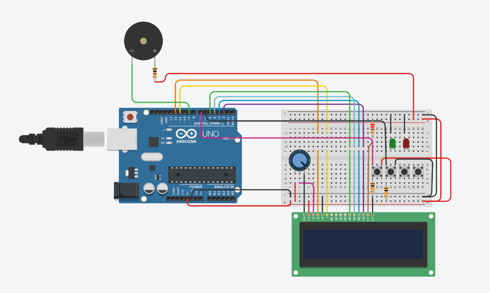
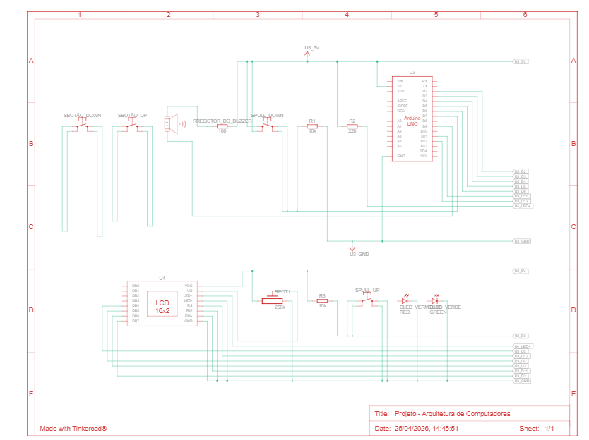

# ArduMusic
Um software arduino para tocar musicas em bips de buzzer


## Montagem inicial do projeto – Dia 20/04/2026

No dia **20/04/2026** foi realizada a montagem inicial do circuito do projeto de um reprodutor de música utilizando a plataforma TickerCard. Nesta etapa, foi feita a organização dos principais componentes eletrônicos na protoboard e a conexão inicial entre o microcontrolador e os dispositivos responsáveis pela interface do sistema.

Foram conectados os seguintes elementos principais:

- Display LCD 16x2 para exibição das informações do sistema  
- Potenciômetro para ajuste de contraste do display  
- Buzzer piezoelétrico para reprodução sonora  
- LEDs verde e vermelho para sinalização do estado do sistema  
- Quatro botões para controle de navegação e seleção  
- Resistores para proteção e controle dos sinais elétricos  

O objetivo desta etapa foi validar a comunicação entre os componentes e estruturar a base física do projeto para a implementação do software nas próximas fases.


## Imagem da montagem

  

## Vista esquemática

  

## Lista de Componentes


##

## Atualização do projeto – Dia 24/04/2026

No dia **24/04/2026** foi realizada a atualização do circuito com a implementação dos resistores de referência pull-up e pull-down para melhorar a estabilidade dos botões do sistema.

Também foi iniciada a configuração das entradas no código para leitura mais confiável dos comandos do usuário, utilizando a configuração:

```cpp
pinMode(BOTAO_UP, INPUT_PULLUP);
pinMode(BOTAO_DOWN, INPUT_PULLUP);
pinMode(BOTAO_PLAY_PAUSE, INPUT_PULLUP);
pinMode(BOTAO_STOP, INPUT_PULLUP);
