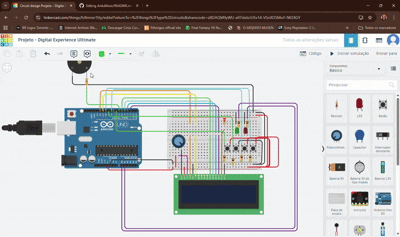
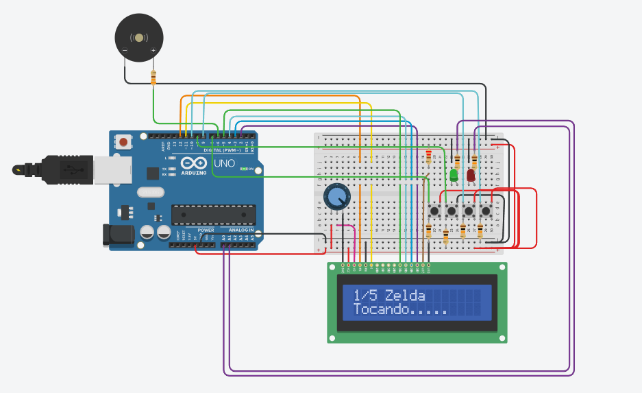

# ArduMusic

Um software arduino para tocar musicas em bips de buzzer

## Montagem inicial do projeto – Dia 20/04/2026

No dia **20/04/2026** foi realizada a montagem inicial do circuito do projeto de um reprodutor de música utilizando a plataforma [Tinkercad](https://www.tinkercad.com/). Nesta primeira etapa, foi feita uma breve organização dos principais componentes eletrônicos na protoboard e a primeira conexão inicial entre o microcontrolador e o LCD(Display responsável pela interface do sistema).

Abaixo os seguintes Componentes Eletrônicos e suas funcionalidades no projeto:

- Display LCD 16x2 para exibição das informações do sistema
- Potenciômetro para ajuste de contraste do display
- Buzzer para reprodução sonora
- LEDs, sendo uma verde e uma vermelha para sinalização do estado da musica, tocando ou pausada
- Quatro botões para controle de navegação e seleção das musicas
- Resistores para proteção dos demais componentes

O objetivo desta etapa foi validar a comunicação entre os componentes e implementar uma estrutura inicial para a implementação do software nas próximas fases.

## Imagem da montagem

  

## Vista esquemática

  

## Lista de Componentes


##

## Atualização do projeto – Dia 24/04/2026

No dia **24/04/2026** foi realizada a atualização do circuito com a implementação dos resistores de referência pull-up e pull-down para melhorar a estabilidade dos botões do sistema.

Também foi feita a configuração das entradas no código para leitura mais confiável dos comandos do usuário, utilizando a configuração:

```cpp
pinMode(BOTAO_UP, INPUT_PULLUP);
pinMode(BOTAO_DOWN, INPUT_PULLUP);
pinMode(BOTAO_PLAY_PAUSE, INPUT_PULLUP);
pinMode(BOTAO_STOP, INPUT_PULLUP);
```

##

## Atualização do projeto – Dia 26/04/2026

No dia **26/04/2026**, foi feito o código para a Navegação de Pull Up(Mexer Para Cima) e Pull Down(Mexer para Baixo), uma lógica de menu utilizando aritmética modular (%), permitando que o usuário navegue entre as 5 músicas de forma infinita retornando ao início ou ao fim da lista automaticamente. Também foi acrescentado o estado de Play,Pause e Stop, onde o mesmo botão alterna entre os estados de "Tocando" e "Pausado" (Toggle). O botão de Stop foi configurado para realizar um reset total das variáveis e interromper o sinal sonoro imediatamente.E por fim, foi colocado a função mostrarMenu() para exibir no LCD a posição real da faixa e o nome da música, mantendo uma instrução fixa de "Selecione..." na segunda linha para melhor usabilidade.

Também foi feitas implementações para o futuro como:

- Integração dos LEDs com as variáveis de estado, onde o LED verde indica reprodução ativa e o LED vermelho sinaliza pausa ou parada do sistema.
  -Implementação de uma trava lógica (musicaIniciada) para garantir que a melodia seja disparada apenas uma vez ao apertar play, evitando bugs de reinicialização contínua do som durante o loop.

## Codigo Implementado

```cpp
// Config De Seleção de Música ---------------------------------------------------------------------
void loop()
{
  // PULL UP --------
  if (digitalRead(BOTAO_UP) == LOW) {
    musicaselecionada = (musicaselecionada + 1) % 5;
    mostrarMenu();
    delay(300);
  }

  // PULL DOWN---------
  if (digitalRead(BOTAO_DOWN) == LOW) {
    musicaselecionada = (musicaselecionada - 1 + 5) % 5;
    mostrarMenu();
    delay(300);
  }

  /// Pausa e Play -------------
if (digitalRead(BOTAO_PLAY_PAUSE) == LOW) {
    if (!tocando) {
      tocando = true;
      pausado = false;
      digitalWrite(LED_VERDE, HIGH);
      digitalWrite(LED_VERMELHA, LOW);
    }
    else {
      pausado = !pausado;

      // Futuramente vai Alterna os led entre Verde (Tocando) e Vermelho (Pausado)
      digitalWrite(LED_VERDE, !pausado);
      digitalWrite(LED_VERMELHA, pausado);
    }
    delay(300);
  }

  // STOP --------------------
 if (digitalRead(BOTAO_STOP) == LOW) {
    noTone(BUZZER);
    tocando = false;
    pausado = false;
    musicaIniciada = false; // Vai dar reset pra poder tocar de novo

    digitalWrite(LED_VERDE, LOW);
    digitalWrite(LED_VERMELHA, HIGH);

    mostrarMenu();
    delay(300);


  // EXECUTA A MÚSICA FORA DOS BOTÕES ♪♬♫
if (tocando && !pausado && !musicaIniciada) {
  musicaIniciada = true;
  // tocarMusica(musicaselecionada);
}
  }
}
// ------------------ Função DO MENU ---------------------------
void mostrarMenu() {
  lcd.clear();

  // LINHA 0: Mostra a posição e o nome da música
  lcd.setCursor(0, 0);
  lcd.print(musicaselecionada + 1);
  lcd.print("/5 ");
  lcd.print(musicas[musicaselecionada]);

  // LINHA 1: Instrução para o usuário
  lcd.setCursor(0, 1);
  lcd.print("Selecione...");
```

##

## Atualização do Projeto – Dia 29/04/2026

No dia 29/04/2026 foram realizadas melhorias na inicialização e no funcionamento geral do sistema. Foi adicionado um fluxo de abertura no display LCD, exibindo o nome do projeto e os créditos das desenvolvedoras antes de entrar no menu principal, deixando a experiência mais organizada e intuitiva desde o início.

Também foi implementado um bip sonoro de inicialização utilizando o buzzer, indicando que o sistema foi ligado corretamente. A lógica dos botões foi ajustada para melhorar a resposta dos comandos, incluindo o uso de pull-up interno em parte das entradas.

O controle de reprodução foi refinado com a organização dos estados do sistema, permitindo distinguir melhor quando a música está tocando, pausada ou ainda não foi iniciada. O botão de Play/Pause passou a iniciar a música caso ela ainda não tenha começado e, caso já esteja em execução, alterna entre os estados de reprodução e pausa.

Além disso, o display passou a exibir mensagens como “Tocando...” e “Pausado”, enquanto os LEDs fornecem um retorno visual claro, indicando o estado atual do sistema. A função de Stop também foi mantida, garantindo a interrupção imediata da música, o reset dos estados e o retorno ao menu principal.

Com essas alterações, o sistema se tornou mais completo, apresentando uma interação mais clara e uma experiência mais fluida para o usuário.

## Menu :



##

## Atualização do Projeto – Dia 02/05/2026

No dia 02/05/2026 foi realizada a implementação completa do sistema de reprodução de músicas no buzzer, consolidando o funcionamento do projeto.

Foram adicionadas as definições de notas musicais e estruturadas as melodias das músicas selecionadas, incluindo temas como Zelda, PacMan, Mario, Asa Branca e Nokia. A partir disso, foi possível criar um sistema capaz de reproduzir sequências de notas com diferentes durações, simulando músicas reais através do buzzer.

Também foi desenvolvida a função responsável por executar as melodias, que seleciona automaticamente a música com base na opção escolhida no menu e controla o tempo de cada nota. Durante a execução, o sistema passou a responder em tempo real aos comandos do usuário, permitindo pausar ou parar a música a qualquer momento.

A lógica de reprodução foi integrada ao loop principal, garantindo que a música só seja executada quando o sistema estiver no estado correto, evitando reinicializações indevidas.

## Imagem :



##

## Atualização do Projeto – Dia 03/05/2026

No dia 03/05/2026 foram realizadas otimizações de memória e melhorias na funcionalidade de pausa do sistema, que não estavam funcionando :( .

Primeiramente, as melodias foram movidas da RAM para a memória Flash utilizando `PROGMEM` e a biblioteca `#include <avr/pgmspace.h>`. As melodias passaram a ser lidas corretamente da Flash memory utilizando `pgm_read_word()`.

Em seguida, foi implementado um sistema coerente de pausa que preserva a posição exata da música. Como funciona? Bom, a variável `indiceMusicaPausada` armazena o índice da nota onde a pausa foi acionada, permitindo que ao pressionar play novamente, a música continue exatamente de onde parou, em vez de reiniciar do início, como antes.
OBS:
O reset automático dos estados também foi implementado ao trocar de música.

Por fim, foi realizada uma refatoração do código para melhor legibilidade, com nomes de variáveis mais descritivos (como `indiceInicial` em vez de `comeco`) e adição de comentários explicativos nas funções principais. Sim, o código acabou tendo muitos comentários...

Isso é tudo :) ...